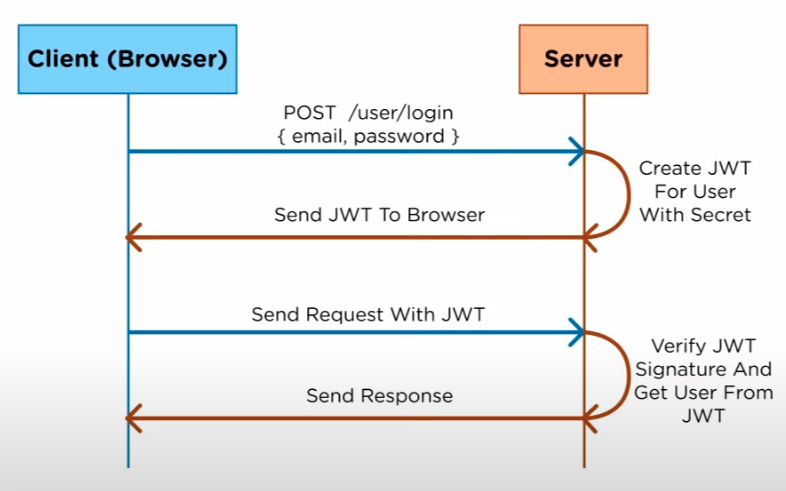

# JWT

Json Web Token

## Preliminares

- Autenticacion verifica la identidad del usuario o de un servicio.

- Autorizacion determina los accesos permitidos.

## Diagrama básico de como funciona un log in usando sessiones, cookies y almacenamiento

## Diagrama básico de como funciona un log in usando JWT

## Diferencia

En la version de sesiones, la información del usuario es almacenada en el servidor, lo cual hace que el servidor tenga que ir a buscar el ID de la sesión respectiva. Por otra parte, usando JWT, la información se almacena en el propio token, lo que significa que se almacena en el cliente, por lo que el servidor no tiene que recordar nada, lo cual es positivo ya que puedo usar ese mismo JWT en diferentes servers que corra sin tener que afrontar problemas de con el ID del server que esté corriendo.

## ¿Cómo JWT firma sus tokens y como se puede almacenar la información del usuario?
