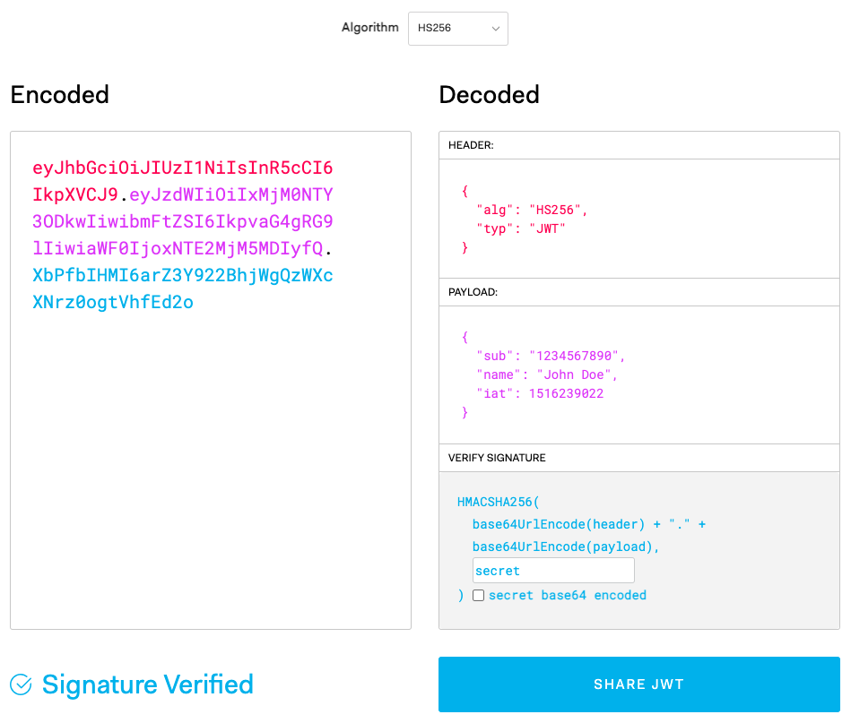

# JWT

Json Web Token

## Preliminares

- Autenticacion verifica la identidad del usuario o de un servicio.

- Autorizacion determina los accesos permitidos.

## Diagrama básico de como funciona un log in usando sessiones, cookies y almacenamiento

## Diagrama básico de como funciona un log in usando JWT

## Diferencia

En la version de sesiones, la información del usuario es almacenada en el servidor, lo cual hace que el servidor tenga que ir a buscar el ID de la sesión respectiva. Por otra parte, usando JWT, la información se almacena en el propio token, lo que significa que se almacena en el cliente, por lo que el servidor no tiene que recordar nada, lo cual es positivo ya que puedo usar ese mismo JWT en diferentes servers que corra sin tener que afrontar problemas de con el ID del server que esté corriendo.

## ¿Cómo JWT firma sus tokens y como se puede almacenar la información del usuario?

En el sitio de JWT.io, podemos encontrar un área para poder configurar las credenciales de nuestro JWT.

En lado izquierdo está el JWT codificado e identificado por diversos colores. Del lado derecho, está la configuración que nosotros podemos aplicar. En la parte de HEADER se encuentra el tipo de algoritmo que estamos usando y el tipo de token. En PAYLOAD está el "sub" que es básicamente el ID del JWT, así como el name (o más información) que estamos manejando del usuario. "1at" hace referencia una posible fecha de expiración del token que nosotros podemos manejar, esto es recomendable porque establecemos cuando el token deja de ser útil así nadie más puede utilizarlo. En VERIFY SIGNATURE es en donde sucede la magia. Los dos primeros apartados hacen una combinación del HEADER y de PAYLOAD, luego, mediante una clave secreta junto con el algoritmo codifica la información que envié al cliente. Si el cliente cambia la información, el JWT no haría match y por lo cual no podría funcionar.
