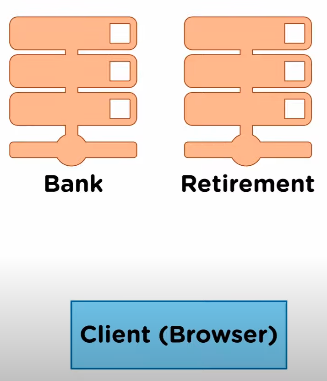

# JWT

Json Web Token es utilizado para la autorización. JSON Web Token (JWT) es un estándar abierto basado en JSON para crear un token que sirva para enviar datos entre aplicaciones o servicios y garantizar que sean válidos y seguros. El caso más común de uso de los JWT es para manejar la autenticación en aplicaciones móviles o web.

## Preliminares

- Autenticacion verifica la identidad del usuario o de un servicio.

- Autorizacion determina los accesos permitidos.

## Diagrama básico de como funciona un log in usando sessiones, cookies y almacenamiento

## Diagrama básico de como funciona un log in usando JWT

## Diferencia

En la version de sesiones, la información del usuario es almacenada en el servidor, lo cual hace que el servidor tenga que ir a buscar el ID de la sesión respectiva. Por otra parte, usando JWT, la información se almacena en el propio token, lo que significa que se almacena en el cliente, por lo que el servidor no tiene que recordar nada, lo cual es positivo ya que puedo usar ese mismo JWT en diferentes servers que corra sin tener que afrontar problemas de con el ID del server que esté corriendo.

## ¿Cómo JWT firma sus tokens y como se puede almacenar la información del usuario?

En el sitio de JWT.io, podemos encontrar un área para poder configurar las credenciales de nuestro JWT.

En lado izquierdo está el JWT codificado e identificado por diversos colores. Del lado derecho, está la configuración que nosotros podemos aplicar. En la parte de HEADER se encuentra el tipo de algoritmo que estamos usando para el hash y el tipo de token. En PAYLOAD está el "sub" que es básicamente el ID del JWT, así como el name (o más información) que estamos manejando del usuario. "1at" hace referencia una posible fecha de expiración del token que nosotros podemos manejar, esto es recomendable porque establecemos cuando el token deja de ser útil así nadie más puede utilizarlo. En VERIFY SIGNATURE es en donde sucede la magia. Los dos primeros apartados hacen una combinación del HEADER y de PAYLOAD, luego, mediante una clave secreta junto con el algoritmo, codifica la información que envié al cliente. Si el cliente cambia la información, el JWT no haría match y por lo cual no podría funcionar. La parte azul es el hash de las dos primeras.

## ¿Por qué usaría JWT?

Supongamos que un banco cuenta con su propio servidor, pero, además de eso, también tiene otro servidor en el que administra toda la información del retiro de sus usuarios. Lo que la gerencia desea es que sus usuarios, una vez inicien sesión en el área del banco, también posean acceso automatico al apartado de retiro, para así evitar que el usuario tenga que hacer log in otra vez.

En el caso de que trabajemos con el método de sesiones y cookies, la sesión se guardaría solo en el área de banco y no en el apartado de Retiro, por lo que el usuario tendría que hacer log in otra vez porque no encuentra la sesión.

Por otra parte, si estamos trabajando con JWT, y si la clave secreta es compartida entre el lado del banco y el del retiro, las cosas serán más sencillas. Básicamente, la información del usuario se guardaría en el cliente, en lugar de en los servidores. Esto me permite que no importe en donde inicie sesión, los servidores podrían reconocer el token con su clave secreta y proveer acceso.

Otro ejemplo sería que el banco contase con dos servidores para el mismo fin. En este caso, se contaría con un loadbalancer el cual distribuiría la carga al servidor que cuente con más disponibilidad. Supongamos que el usuario ingresa al servidor #1, pero existe demasiado tráfico y es trasladado al servidor #2, en el caso de trabajar con sesiones, esto provocaría que la sesión se cerrara y que el usuario se viera obligado a iniciar otra. Trajando con JWT, esto no sería necesario, ya que la información estaría almacenada en el cliente, así que no importaría cuantos servers o loadbalancers tenga, el usuario siempre se podría autenticar media vez compartan la misma clave secreta entre ellos.
