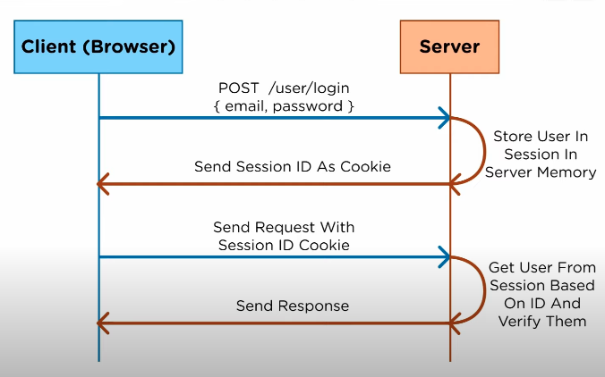

# JWT

## Preliminares

- Autenticacion verifica la identidad del usuario o de un servicio.

- Autorizacion determina los accesos permitidos.

## Diagrama básico de como funciona un log in tradicional usando cookies y almacenamiento

## Diagrama básico de como funciona un log in usando JWT

## Diferencias
